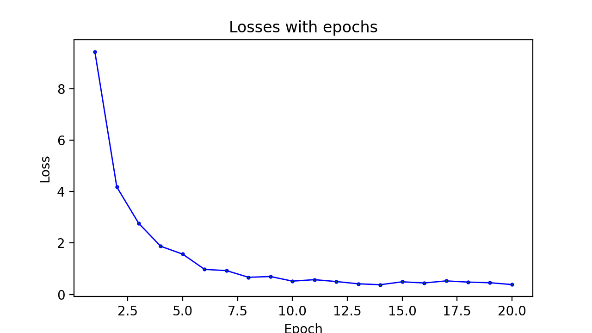

# Named Entity Recognition

spaCy version: 3.0.6

Named entities of interest:  
1. Musical instrument ("INSTR") 
2. Sound quality ("QLTY")

## Dataset Used

Dataset used is the [pf_data.csv]() file, the contents of which was scrapped from Reddit.

* TRAIN data:  541
* TEST data:  60
* EVAL data: 60

## Training Hyperparameters

Defined in `utilities.py`, parameter values found optimal for the given dataset:

* ITERATIONS (epochs) = 20
* DROPOUT = 0.1
* LEARN_RATE = 0.001

## Functions

* `fit(train_data, eval_data)`: Trains the NER model with `train_data` and evaluates after every epoch with `eval_data`
* `evaluate(test_data)`: evaluates the trained NER model on `test_data` and returns a dict of scores. Called automatically by `fit()`.
* `k_cross_validation(data, k=10)`: Trains the NER model by performing k-fold Cross Validation. Divides data into k parts, uses (1/k)th part for evaluation and trains on rest (k - (1/k)) parts, such that all k parts have been individually used for evaluation during each fold. Automatically calls `fit()` during each fold.
* `predict(X)`: Loads the saved model and predicts the entities on the sentence string `X`.

## Outputs

### F-Score during training

### Training Loss

